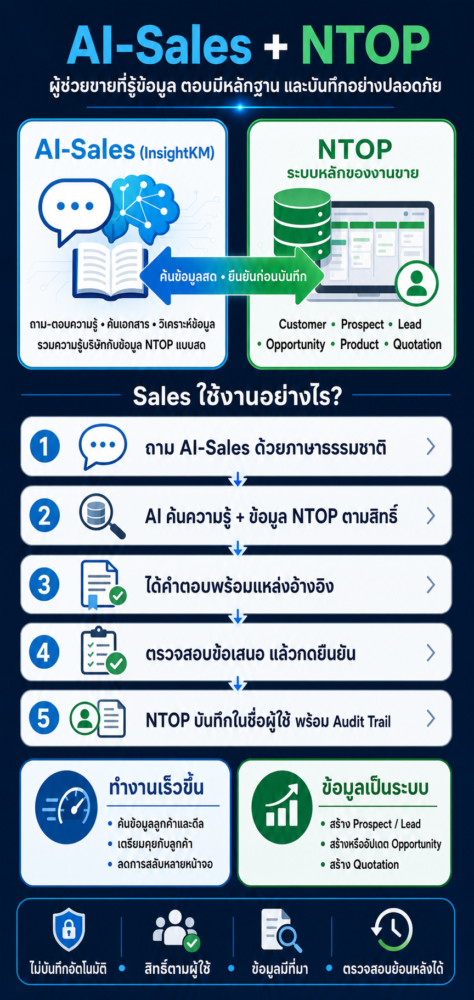

# AI-Sales และ NTOP: ภาพรวม รายละเอียด และความสัมพันธ์

อัปเดตจากโค้ดและเอกสารใน workspace ณ วันที่ 24 สิงหาคม 2026

## สรุป

AI-Sales เป็นแพลตฟอร์ม Enterprise Knowledge, AI Chat, RAG, Analytics และผู้ช่วยสนทนา ส่วน NTOP เป็นระบบหลักที่เก็บและควบคุมวงจรงานขายจริง

> AI-Sales ทำหน้าที่ “รู้ ค้น สรุป และเสนอ” ส่วน NTOP ทำหน้าที่ “ตรวจสิทธิ์ บันทึก ควบคุม workflow และเก็บ audit”



## เปรียบเทียบภาพรวม

| หัวข้อ | AI-Sales | NTOP |
| --- | --- | --- |
| บทบาทหลัก | Enterprise Knowledge และ AI Platform | Enterprise Sales System of Record |
| ข้อมูลที่เป็นเจ้าของ | เอกสาร ความรู้ Bot, Chat, Dashboard, Citation, Memory และ AI Proposal | Customer, Prospect, Lead, Opportunity, Product, Quote, Approval, Contract และ Activity |
| ฐานข้อมูลหลัก | PostgreSQL และ pgvector | MySQL; รองรับระบบ MariaDB 5.5 เดิมแบบ best-effort และกำหนดเป้าหมาย production เป็น MySQL 8 |
| Background processing | Redis, BullMQ และ NestJS Worker | ปัจจุบันเป็น Next.js modular monolith; queue และ search แบบ HA เป็นสถาปัตยกรรมเป้าหมาย |
| AI หลัก | RAG, Knowledge Chat, Text-to-SQL, Dashboard generation และ Business Insight | AI ช่วยงานขายเฉพาะ record และ workflow |
| การเขียนข้อมูลขาย | ไม่ถือข้อมูลขายเป็น master; เสนอ action แล้วเรียก NTOP | บันทึกข้อมูลจริงและบังคับ business rules |
| รูปแบบสิทธิ์ | Organization, Workspace, Role และ ACL ต่อ Bot, Rack, Source และ Data Source | Role × Organization × Ownership × Assignment × Workflow responsibility |
| ความสัมพันธ์ | เรียก NTOP REST API แบบ live | ตรวจ API key เป็นผู้ใช้ NTOP แล้วใช้ domain service เดิมดำเนินการ |

## 1. AI-Sales คืออะไร

AI-Sales เป็นแพลตฟอร์ม AI และการจัดการความรู้แบบ multi-tenant สำหรับเชื่อมแหล่งข้อมูลที่อยู่ภายใต้การกำกับดูแล ค้นหาโครงสร้างข้อมูล และสร้างผลวิเคราะห์ที่ตรวจสอบหลักฐานได้

### 1.1 Knowledge และ Chat

- สร้าง Bot หลายตัว โดยกำหนด provider, prompt, memory, citation และแหล่งข้อมูลแยกกัน
- จัดกลุ่มความรู้เป็น Knowledge Rack พร้อมสิทธิ์ Read, Upload และ Manage
- รับ PDF, DOCX, XLSX, CSV, TXT, Markdown และ HTML
- นำเข้าจากไฟล์, shared folder แบบ read-only และเว็บที่ผ่าน domain และ SSRF policy
- แยกเอกสารเป็น chunk, สร้าง embedding และเก็บใน pgvector
- ค้นหาแบบ hybrid vector และ full-text โดยกรอง ACL ก่อน retrieval
- สนทนาไทยและอังกฤษ พร้อม citation และนโยบายไม่ตอบเมื่อไม่มีหลักฐาน
- มีประวัติสนทนา, feedback, saved chat และ conversation summary
- มี Memory แบบต้องได้รับ consent แยกตาม Bot พร้อม expiry และลบจริงได้
- วิเคราะห์คำถามซ้ำ เรื่องที่ผู้ใช้ถามบ่อย ช่องว่างความรู้ และแหล่งข้อมูลที่ตอบได้ไม่ดี

### 1.2 ข้อมูลและ Dashboard

AI-Sales ไม่ได้จำกัดอยู่เพียงการค้นเอกสาร แต่สามารถเชื่อมฐานข้อมูลเพื่อวิเคราะห์ได้ด้วย

- รองรับ MySQL/MariaDB, PostgreSQL, SQL Server และ Oracle
- ค้นพบ schema, table, column, primary key, foreign key และ metadata
- เลือก table หรือ view ที่อนุญาตให้ AI ใช้งาน
- สร้างคำอธิบาย semantic ของตารางและคอลัมน์
- ทำ Text-to-SQL โดยอนุญาตเฉพาะ read-only `SELECT` หรือ `CTE`
- ตรวจ SQL ด้วย AST, block DML/DDL และจำกัดเวลาและจำนวนแถว
- ให้มนุษย์ตรวจสอบก่อน execute
- สร้าง KPI, query, dashboard plan, widget และ insight จากผล query จริง
- รองรับ KPI, line, area, bar, donut, gauge, funnel, waterfall, scatter, radar, treemap, heatmap, timeline, flow และ map
- Dashboard ที่อนุมัติแล้วเป็น immutable version และไม่สร้างข้อมูลจำลองเมื่อ query ล้มเหลว

### 1.3 Legacy API และเครื่องมือภายนอก

AI-Sales มี Registry สำหรับกำหนด API tool โดยผู้ดูแลระบบ ดังนี้

- GET หรือ read-only POST ที่ยืนยันแล้ว
- Path, query และ body parameters
- API key, Bearer, Basic และ custom header authentication
- JSON Schema และ response mapping
- จำกัด domain, DNS/IP, redirect, timeout และ response size
- Credential ถูกเข้ารหัสและไม่ถูกส่งกลับไปยัง browser
- Bot ต้องได้รับ allowlist ก่อนเรียกใช้

กลไกนี้เป็นระบบเชื่อม API แบบทั่วไป ต่างจาก NTOP integration ซึ่งมี client และ orchestration เฉพาะของตัวเอง

### 1.4 Identity และ Security

- รองรับ Local authentication, External Authentication API และ Embedded signed identity
- Embedded widget รองรับ HMAC SHA-256 หรือ JWT HS256
- มี nonce replay protection, exact-origin allowlist และ opaque widget session
- แยก tenant ผ่าน Organization และ Workspace
- ใช้ deny-by-default authorization ต่อ Bot, Rack, Source, Document, Database, API และ Insight
- เข้ารหัส credential ด้วย AES-256-GCM และ key version เพื่อรองรับ rotation
- Mask ข้อมูล PDPA ก่อนส่ง external AI
- ป้องกัน prompt injection, SSRF, DNS rebinding, credential leakage และ unsafe redirect
- เก็บ audit โดยไม่เก็บ raw prompt, raw SQL result, document contents หรือ secret
- มี SLO dashboard, circuit breaker, queue backpressure, stale-operation recovery และ backup/restore runbook

### 1.5 สถาปัตยกรรม

```text
Browser
  → Next.js 16.3 Web/BFF
      → PostgreSQL + pgvector
      → Redis/BullMQ
      → NestJS Worker
      → AI Provider
      → Database Connectors
      → Knowledge Sources
      → NTOP REST API
```

AI-Sales เป็น modular monolith repository เดียว แต่แยก Web และ Worker process อย่างชัดเจน Redis เป็น transport สำหรับงานเบื้องหลัง ไม่ใช่ system of record ส่วน PostgreSQL เป็น system of record ของ AI-Sales

## 2. NTOP คืออะไร

NTOP คือระบบควบคุมงานขายลูกค้าองค์กรแบบ end-to-end เป้าหมายคือให้ Sales, Presales, Coverage, Pricing, Contract และ Order Operations ใช้ข้อมูลและ workflow ชุดเดียวกัน ลดการพึ่ง spreadsheet และทำให้ forecast และ approval ตรวจสอบย้อนหลังได้

### 2.1 วงจรงานหลัก

```text
Prospect
  → Lead
  → Customer + Opportunity
  → Solution Design
  → Site Survey
  → BOQ
  → Proposal / Quote Version
  → Commercial Approval
  → Accepted Quote
  → Contract
  → Internal Service Order / Customer Activity
```

เส้นทางนี้มี browser E2E audit ผ่านแล้วสำหรับ happy path และ correction loop สำคัญ เช่น send-back, revision, reject, resubmit และ maker-checker

### 2.2 โมดูลธุรกิจ

- Identity, Users, Roles, Organization Units และ permissions
- Customer 360, contacts, external IDs, hierarchy, ownership และ duplicate merge
- Prospect, contacts, activities, documents, scoring, import/export และ conversion
- Lead, assignment, qualification, merge, saved views และ conversion
- Customer Activity, assignment, status และ completion
- Opportunity, pain point, requirement, stakeholder, competitor และ stage history
- Pipeline, Forecast Snapshot, Fiscal Calendar และ Sales Target
- Product catalog, cost/floor price และ coverage checks
- Solution Design, version, service item, component, network connection และ risk
- Site Survey, schedule, assignment, result และ review
- BOQ และ revision
- Proposal, template, version และ AI-generated draft
- Quote และ immutable Quote Version
- Commercial Approval, policy version, authority และ decisions
- Contract, versions, reviews, documents, signatures, amendments และ renewals
- Purchase Order และ Service Order handoff
- Dashboard, audit, deleted-record administration และ Help Center

### 2.3 กฎธุรกิจสำคัญ

- Customer ใช้ stable internal identity แยกจาก external system ID
- Lead conversion ต้องผูก Customer เดิมหรือสร้างใหม่หลัง duplicate review
- Opportunity หนึ่งรายการมี contracting Customer หลักเพียงหนึ่งราย
- Quote ต้องอยู่ใต้ Opportunity และสืบทอด Customer จาก Opportunity
- Quote ที่ submit แล้วใช้ immutable version
- การแก้ข้อมูลสำคัญทำให้ approval เดิมเป็น superseded
- Approval ใช้ policy version, authority, maker-checker และ segregation of duties
- การเขียนข้อมูลสำคัญใช้ transaction, audit และ idempotency receipt
- การ update ใช้ optimistic concurrency และ record version
- การไม่มีสิทธิ์เห็น record จะคืน 404 เพื่อไม่เปิดเผยการมีอยู่ของข้อมูลข้าม scope

### 2.4 AI ภายใน NTOP

NTOP มีระบบ AI ของตัวเองแยกจาก AI-Sales ได้แก่

- Admin-managed OpenAI-compatible provider
- Meeting/Visit Draft จากข้อความที่พิมพ์หรือ paste
- Next Action Recommendation ซึ่งสร้าง Activity หลังผู้ใช้ยืนยัน
- Deterministic Deal Risk Signal พร้อม AI explanation
- Proposal Draft จาก Opportunity, Customer, Product และ Template
- Prospect Insight จากข้อมูล Prospect ที่ผู้ใช้มีสิทธิ์
- Read-only Contract หรือ Document analysis
- Page Assistant ที่สรุปข้อมูลในหน้าปัจจุบันและตอบจาก Help Center

หลักการคือ **AI proposes, human decides** เช่นเดียวกัน AI outage ต้องไม่ block workflow หลัก และ provider key ถูกเข้ารหัสด้วย `AI_CONFIG_MASTER_KEY`

NTOP ไม่ได้เรียก AI provider ของ AI-Sales สำหรับความสามารถเหล่านี้โดยอัตโนมัติ ทั้งสองระบบมี provider configuration, credential, policy และ audit ของตนเอง

## 3. ความสัมพันธ์ระหว่าง AI-Sales และ NTOP

### 3.1 การอ่านข้อมูล

1. ผู้ใช้ถาม AI-Sales ด้วยภาษาธรรมชาติ เช่น “หา Opportunity ของบริษัท ABC จาก NTOP”
2. AI-Sales ตรวจว่าเป็น sales signal หรือ explicit NTOP lookup
3. Backend เรียก NTOP REST API โดยตรง
4. NTOP แปลง Bearer API key เป็นผู้ใช้ NTOP
5. NTOP ใช้ permission และ organization scope ของผู้ใช้นั้นค้นข้อมูล
6. ข้อมูลถูกส่งกลับเป็น grounded context ให้คำตอบ
7. AI-Sales บันทึก citation และ tool trace แต่ไม่นำข้อมูล NTOP ไปสร้าง vector index ถาวร

ข้อมูลที่ค้นได้ประกอบด้วย Customer, Prospect, Lead, Opportunity, Product และ Quotation รวมถึง resource detail ของ Prospect, Lead, Product และรายการที่รองรับอื่น เมื่อผู้ใช้ขอให้ออกแบบ Solution ระบบจะค้นเฉพาะ Product ที่ active, ดึงรายละเอียดและ `listPrice` จาก NTOP มาเป็น grounded context โดยไม่ส่ง floor price หรือ standard cost เข้า prompt และไม่สร้าง Solution Design record โดยอัตโนมัติ

### 3.2 การเขียนข้อมูล

```text
ข้อความผู้ใช้
 → ตรวจ intent และดึงข้อมูล NTOP เพื่อตรวจรายการเดิม
 → สร้าง NtopActionProposal ใน AI-Sales
 → แสดงรายละเอียดให้ผู้ใช้ตรวจ
 → ผู้ใช้กด Confirm
 → Atomic claim: PENDING → EXECUTING
 → เรียก NTOP ด้วย personal API key + idempotency key
 → NTOP ตรวจสิทธิ์และบันทึกในชื่อผู้ใช้ NTOP
 → บันทึก audit ทั้งสองระบบ
 → COMPLETED หรือ FAILED
```

Proposal มีอายุ 24 ชั่วโมง และมีสถานะดังนี้

- `PENDING`
- `EXECUTING`
- `COMPLETED`
- `FAILED`
- `CANCELLED`
- `EXPIRED`

หากกดยืนยันซ้ำ การ atomic claim และ idempotency key จะป้องกันการสร้าง business effect ซ้ำ

### 3.3 การเชื่อมตัวตนผู้ใช้

ทั้งสองระบบมี User ของตัวเอง ไม่ได้ใช้ shared session หรือ shared user ID

- ผู้ดูแล NTOP สร้างหรือ rotate API key ประจำผู้ใช้
- ค่า API key เต็มแสดงครั้งเดียว
- NTOP เก็บเฉพาะ SHA-256 hash, prefix และวันออก key
- AI-Sales รับ key ของผู้ใช้คนนั้นและเก็บแบบ AES-GCM encrypted
- เวลาเรียก NTOP จะส่ง `Authorization: Bearer <personal-key>`
- NTOP จึงบันทึก owner, maker, timestamp และ audit เป็นผู้ใช้จริง ไม่ใช่ integration bot กลาง

มี shared integration key แบบ legacy ได้ แต่ใช้เป็น read fallback ระหว่าง migration เท่านั้น การเขียนต้องใช้ personal API key

### 3.4 สิ่งที่ AI-Sales เสนอได้จริงใน Chat ปัจจุบัน

Conversational orchestrator ปัจจุบันสร้าง proposal ได้ชัดเจนสำหรับกรณีต่อไปนี้

- ไม่พบข้อมูลเดิม → เสนอสร้าง Prospect
- พบ Prospect และมีข้อมูลผู้ติดต่อครบ พร้อมคำสั่งชัดเจน → เสนอสร้าง Lead
- พบ Customer และมี requirement, solution หรือ value → เสนอสร้าง Opportunity
- พบ Lead หรือ Opportunity เดิม → หยุดและเตือนเรื่องข้อมูลซ้ำ

Client, enum และ action service มีโครงสร้างสำหรับ `UPDATE_OPPORTUNITY` และ `CREATE_QUOTATION` แล้ว แต่ conversational orchestration ปัจจุบันยังไม่มีเส้นทางที่สร้าง proposal สองชนิดนี้อย่างชัดเจน จึงควรถือว่าโครงสร้างรองรับแล้ว แต่ orchestration ยังไม่ครบ

### 3.5 สิ่งที่ไม่ได้เชื่อมกัน

- ทั้งสองระบบไม่แชร์ฐานข้อมูล
- AI-Sales ไม่เป็น master ของข้อมูลขาย
- NTOP ไม่ใช้ PostgreSQL หรือ pgvector ของ AI-Sales
- การเปลี่ยน AI provider ใน NTOP ไม่เปลี่ยน provider ของ AI-Sales
- NTOP integration ไม่ได้เรียกผ่าน Legacy API Registry ทั่วไป แต่ใช้ dedicated client
- AI-Sales มี embedded widget พร้อมใช้ แต่ในโค้ด NTOP ปัจจุบันยังไม่พบการฝัง widget นี้
- ทั้งสองระบบใช้ SSH host alias `ntop` ในเอกสาร deployment แต่เป็นคนละ application path, runtime และ data store

## 4. ตัวอย่างการทำงาน

ผู้ใช้พิมพ์ใน AI-Sales:

> บริษัท ABC สนใจ SD-WAN งบประมาณ 5 ล้านบาท ช่วยบันทึกให้หน่อย

ระบบจะทำงานตามลำดับดังนี้

1. ตรวจจับชื่อบริษัท, solution และ estimated value
2. ค้นหา Customer, Prospect, Lead และ Opportunity ของ ABC จาก NTOP
3. หากไม่พบ record เดิม ระบบจะเสนอสร้าง Prospect
4. หากพบ Customer แต่ยังไม่มี Opportunity ระบบจะเสนอสร้าง Opportunity
5. แสดง action card พร้อมข้อมูลสรุป
6. ยังไม่มีข้อมูลใดถูกเขียนจนกว่าผู้ใช้จะกด Confirm
7. หลัง Confirm ระบบเรียก NTOP ด้วย personal API key ของผู้ใช้
8. NTOP ตรวจสิทธิ์, validation, duplicate, idempotency และ audit
9. AI-Sales แสดงผล `COMPLETED` หรือ sanitized failure

## 5. ขอบเขตความรับผิดชอบที่แนะนำ

| ความรับผิดชอบ | ระบบที่ควรเป็นเจ้าของ |
| --- | --- |
| ข้อมูล Customer, Lead, Opportunity, Quote และ Contract | NTOP |
| Workflow, transition, approval และ maker-checker | NTOP |
| Ownership, organization scope และ commercial authorization | NTOP |
| เอกสารความรู้ คู่มือ นโยบาย และ RAG | AI-Sales |
| การถามตอบข้าม Knowledge และข้อมูลขายแบบ live | AI-Sales |
| Conversational intent และข้อเสนอ action | AI-Sales |
| การยืนยันและบันทึก business record จริง | NTOP |
| Chat history, citation, memory และ knowledge analytics | AI-Sales |
| Audit การเปลี่ยนข้อมูลขาย | NTOP |
| Audit การใช้ AI, retrieval และ action proposal | AI-Sales |

## 6. สถานะการตรวจสอบ

ตรวจจากโค้ด local ปัจจุบัน ณ วันที่ 24 สิงหาคม 2026 และรันชุดทดสอบเฉพาะ integration แล้ว

- AI-Sales: 3 test files และ 25 tests ผ่านทั้งหมด
- NTOP: 2 test files และ 11 tests ผ่านทั้งหมด
- ยังไม่ได้รัน full lint, build หรือ E2E suite สำหรับการจัดทำเอกสารฉบับนี้

## เอกสารอ้างอิง

### AI-Sales

- [README](../README.md)
- [Runtime Architecture](adr/0001-runtime-architecture.md)
- [Queue and Jobs](adr/0002-queue-and-jobs.md)
- [Vector and Storage](adr/0003-vector-and-storage.md)
- [NTOP Business Memory Integration](ntop-business-memory.md)
- [Embedded Widget](embedded-widget.md)
- [Rich Dashboard Engine](rich-dashboard-engine.md)
- [Enterprise Security](enterprise-security.md)

### NTOP

- [Product Requirements](../../ntop/docs/product-requirements.md)
- [Domain Model](../../ntop/docs/domain-model.md)
- [System Architecture](../../ntop/docs/system-architecture.md)
- [Roles and Permissions](../../ntop/docs/roles-and-permissions.md)
- [AI Design](../../ntop/docs/ai-design.md)
- [End-to-End Sales Flow Audit](../../ntop/docs/end-to-end-sales-flow-audit.md)
