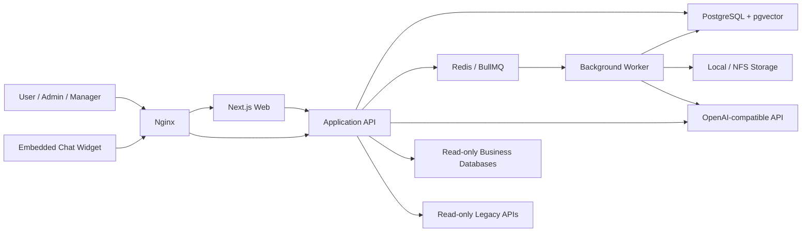
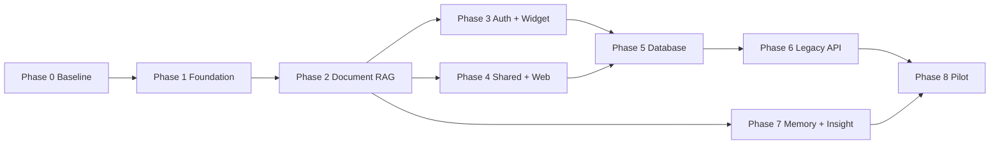

# InsightKM Version 1 — Development Plan

> แผนพัฒนาระบบ Enterprise AI Knowledge Platform ตาม requirement ฉบับวันที่ 16 สิงหาคม 2026

## 1. เป้าหมายและขอบเขต

InsightKM Version 1 ต้องเป็นระบบพื้นฐานที่ใช้งานจริงได้สำหรับองค์กร โดยมีคุณสมบัติหลักดังนี้

- สร้างและบริหาร AI Bot ได้หลาย Bot
- เชื่อม OpenAI-compatible Chat และ Embedding API
- ตอบจากเอกสาร Shared Folder, Database และ Legacy API พร้อม Citation
- ตรวจสิทธิ์ตาม Role และ ACL ก่อนค้นข้อมูลและก่อนส่ง Context ให้ LLM
- รองรับ Local, External API และ Signed Embedded Authentication
- เก็บ Conversation, Chat History และ User Memory อย่างปลอดภัย
- วิเคราะห์ Chat History เป็น Business Insight ตามขอบเขตสิทธิ์
- ฝัง Chat Widget ในระบบภายนอกได้
- รัน Application, API, Worker, PostgreSQL/pgvector, Redis และ Nginx ด้วย Docker Compose

Version 1 ใช้แนวทาง **Modular Monolith** ห้ามเพิ่ม Microservice โดยไม่มีเหตุผลด้านการแยกโหลดหรือความปลอดภัยที่ชัดเจน

## 2. สถานะระบบปัจจุบัน

ระบบเดิมมีองค์ประกอบที่นำมาใช้ต่อได้แล้ว:

| ความสามารถ                              | สถานะ           | แนวทางต่อยอด                                                 |
| --------------------------------------- | --------------- | ------------------------------------------------------------ |
| Next.js 16, TypeScript, Tailwind CSS    | พร้อมใช้        | ใช้เป็น Web Application และ BFF ระหว่างช่วงเปลี่ยนผ่าน       |
| PostgreSQL และ Prisma                   | พร้อมใช้        | เพิ่ม pgvector และ Knowledge/Chat models ผ่าน migration      |
| Local Authentication, Argon2id, Session | พร้อมใช้บางส่วน | เพิ่ม Authentication Mode และ External/Embedded flow         |
| User, Role, Permission, Resource Access | พร้อมใช้บางส่วน | ขยาย ACL ไปยัง Bot, Rack, Source, Document, API และ Chat     |
| Audit Log และ Login History             | พร้อมใช้        | เพิ่ม event catalog ของ InsightKM                            |
| OpenAI-compatible provider              | พร้อมใช้บางส่วน | แยก Chat/Embedding model configuration และ provider health   |
| MySQL metadata discovery และ Safe SQL   | พร้อมใช้บางส่วน | ขยาย PostgreSQL, MSSQL, Oracle และ semantic metadata search  |
| Excel import และ Storage interface      | พร้อมใช้บางส่วน | เพิ่ม document parser, chunk, embedding และ index job        |
| AI analysis และ Business Dashboard      | พร้อมใช้บางส่วน | ปรับเป็น Business Insight จาก Chat History และ Knowledge Gap |
| Redis/Background Worker                 | ยังไม่มี        | เพิ่ม BullMQ worker และ retry/dead-letter policy             |
| Document RAG, Bot Chat, Citation        | ยังไม่มี        | พัฒนาใน Phase 2                                              |
| Shared Folder, Web Source, Legacy API   | ยังไม่มี        | พัฒนาใน Phase 4 และ 6                                        |
| Embedded Widget                         | ยังไม่มี        | พัฒนาใน Phase 3                                              |

หลักการสำคัญคือ **ไม่ลบของเดิมที่ใช้งานได้** แต่ครอบด้วย interface ใหม่และย้ายทีละ capability โดยมี regression test

## 3. Target Architecture

### 3.1 โครงสร้างระบบเป้าหมาย



### 3.2 การจัดโครงสร้างโค้ด

ระหว่าง Version 1 ให้ใช้ TypeScript เป็นหลักเพื่อลดภาษาและเครื่องมือที่ทีมต้องดูแล โดยเลือก **NestJS เป็น Backend Framework** และใช้ร่วมกันทั้ง API กับ Worker:

```text
apps/
  web/                 Next.js UI และ BFF เฉพาะจุดที่จำเป็น
  api/                 NestJS Modular Monolith API
  worker/              NestJS application context + BullMQ consumers
packages/
  contracts/           Zod schemas, DTOs และ API result types
  auth/                Authentication/authorization policy
  knowledge/           Parsing, chunking, retrieval interfaces
  connectors/          Database, web และ legacy API connectors
  ai/                  Chat, embedding, rerank provider interfaces
  observability/       Logger, audit, metrics และ tracing helpers
```

ในช่วงเริ่มต้นให้คง Next.js Server Actions/API Routes ที่มีอยู่ แล้วใช้ **Strangler Migration** ย้าย capability ใหม่เข้า NestJS ก่อน จากนั้นจึงย้าย service เดิมเฉพาะเมื่อมี regression test ครอบคลุม ห้ามทำ mechanical rewrite ทั้งระบบในครั้งเดียว

### 3.3 กติกา API

- API ใช้ prefix `/api/v1`
- Response มาตรฐาน: `{ data, meta, error, requestId }`
- ใช้ Zod validation ที่ boundary ทุกจุด
- List API ต้องมี cursor/page pagination, filter และ sort ที่กำหนดชัดเจน
- Error ภายนอกใช้ stable error code และห้ามส่ง stack trace หรือ secret
- ทุก request สำคัญต้องมี `requestId`, actor, tenant/workspace และ audit context
- Secret และ credential อ่านจาก Environment Variables หรือ encrypted storage เท่านั้น

## 4. Phase Gate และ Definition of Done

ทุก Phase ต้องผ่าน Gate ต่อไปนี้ก่อนเริ่ม Phase ถัดไป:

- Acceptance criteria ของ Phase ผ่านครบ
- `npm run lint`, `npm run typecheck` และ `npm test` ผ่าน
- Integration tests ที่ต้องใช้ PostgreSQL/Redis/connector ผ่านใน Docker Compose
- ไม่มี Critical/High security finding ที่ยังไม่ระบุ mitigation
- Migration สามารถ apply กับฐานข้อมูลว่างและฐานข้อมูลจาก Phase ก่อนหน้าได้
- มี seed/demo data และคู่มือทดสอบสำหรับ capability ใหม่
- API และ environment variables ถูกบันทึกใน README/OpenAPI
- UI มี loading, empty, error และ permission-denied states
- Audit event สำคัญถูกบันทึกโดยไม่เก็บ secret หรือ sensitive raw value

---

## Phase 0 — Baseline, Architecture และ Migration Safety

**ระยะเวลาโดยประมาณ:** 1–2 สัปดาห์  
**เป้าหมาย:** ทำให้ระบบปัจจุบันเป็น baseline ที่วัดผลได้ และเตรียมโครงสร้างสำหรับเพิ่ม Knowledge Platform โดยไม่ทำ regression

### งานพัฒนา

- [ ] สรุป capability matrix ของ source code ปัจจุบันเทียบ requirement
- [ ] กำหนด module boundary: Identity, Bot, Knowledge, Chat, Connector, Insight, Audit
- [ ] เพิ่ม Architecture Decision Records สำหรับ API, Worker, Queue, Storage และ Vector Search
- [ ] กำหนด API response/error contract และ request ID
- [ ] เพิ่ม PostgreSQL `vector` extension ใน migration และ Docker health check
- [ ] เพิ่ม Redis ใน Docker Compose พร้อม authentication/configuration สำหรับ production
- [ ] เตรียม Worker process และ BullMQ queue skeleton
- [ ] แยก Environment Schema ตาม Web/API/Worker และตรวจ fail-fast เมื่อค่าจำเป็นหาย
- [ ] สร้าง test fixture สำหรับ Admin, Manager, User, Department และ ACL หลายขอบเขต
- [ ] เพิ่ม CI stages: format check, lint, typecheck, unit, integration, build และ migration check

### Acceptance Criteria

- `docker compose up` เปิด Web, Database, Redis และ Worker ได้
- Worker รับและ complete health-check job ได้อย่างน้อยหนึ่งงาน
- pgvector query ตัวอย่างทำงานได้
- Migration เดิมทั้งหมด apply ตามลำดับได้และข้อมูลเดิมไม่สูญหาย
- Test fixture พิสูจน์ได้ว่า User ข้าม Department ไม่เห็น resource ของกันและกัน

### Verification

```bash
docker compose up -d
npm run db:deploy
npm run lint
npm run typecheck
npm test
npm run build
```

**ผลลัพธ์ที่ส่งต่อ:** Platform baseline, queue/worker skeleton และ migration-safe foundation

---

## Phase 1 — Identity, Administration และ Provider Foundation

**ระยะเวลาโดยประมาณ:** 2–3 สัปดาห์  
**เป้าหมาย:** ทำ Foundation ตาม requirement ให้ครบก่อนเริ่ม RAG

### 1.1 Identity และ Role

- [x] ปรับ Role มาตรฐานเป็น Admin, Manager และ User โดยมี compatibility mapping จาก role เดิม
- [x] เพิ่ม Department/Organization Unit และ Project scope ให้ User
- [x] เพิ่ม session expiration, logout-all-sessions และ forced password change
- [x] ตรวจ brute-force/rate-limit ทั้ง username, IP และ recovery endpoint
- [x] เพิ่มหน้าจอ Profile และ Change Password
- [x] กำหนด permission catalog สำหรับ Bot, Knowledge, Chat, Insight และ System Configuration

### 1.2 Admin Configuration

- [x] สร้าง Admin Dashboard และเมนูตาม capability ที่เปิดใช้จริง
- [x] CRUD Users, Roles และ ACL พร้อม audit trail
- [x] CRUD LLM Provider โดยแยก Chat Model และ Embedding Model
- [x] เก็บ API Key แบบ encrypted และคืน frontend เฉพาะ masked value
- [x] เพิ่ม Test Connection, timeout, active/inactive และ provider health
- [x] เพิ่ม PII Masking Policy ขั้นต้นและ System Health page

### 1.3 Audit และ Monitoring

- [x] เพิ่ม audit event catalog ตาม requirement
- [x] Structured log ต้อง mask password, token, API key, connection string และ raw sensitive values
- [x] Health check: Application, Database, Redis/Worker, Provider, Vector Store และ Storage
- [x] เพิ่ม retention configuration สำหรับ Audit และ Login History

### Acceptance Criteria

- Admin สร้าง/ปิดใช้/reset password ของ User ได้
- Manager และ User ไม่เห็น Admin APIs แม้เรียก URL โดยตรง
- Provider key ไม่ปรากฏใน API response, HTML, log หรือ audit metadata
- Test Connection แยกผล Chat และ Embedding model ได้
- ทุก config change สร้าง audit event พร้อม actor, before/after แบบ sanitized

### Verification

- Unit test permission matrix ของ Admin/Manager/User
- Integration test session invalidation และ brute-force lock
- API test provider create/update/test โดยตรวจว่า secret ไม่รั่ว
- Manual check Admin Dashboard และ System Health ทั้ง success/failure states

**ผลลัพธ์ที่ส่งต่อ:** Identity, provider และ governance foundation ที่ RAG/Chat ใช้ร่วมกัน

---

## Phase 2 — Bot Management, Document RAG และ Core Chat

**ระยะเวลาโดยประมาณ:** 4–6 สัปดาห์  
**เป้าหมาย:** ส่งมอบ vertical slice แรกที่ผู้ใช้สามารถถาม Bot จากเอกสารและเห็น Citation ได้จริง

### 2.1 Bot Management

- [x] Models: Bot, BotVersion, BotAccess, BotKnowledgeRack, BotProviderConfig
- [x] CRUD Bot: name, description, avatar, prompt, welcome, suggested questions
- [x] ตั้งค่า model, temperature, max tokens, context size, citation และ memory mode
- [x] Active/Inactive และ versioned configuration
- [x] ACL ระดับ Role และ User
- [x] Bot Selection page สำหรับผู้ใช้

### 2.2 Knowledge Rack และ File Source

- [x] Models: KnowledgeRack, KnowledgeSource, Document, DocumentVersion, Chunk, IndexJob
- [x] ACL ระดับ Rack, Source และ Document
- [x] Storage adapter สำหรับ Local/NFS พร้อม interface สำหรับ S3/MinIO ในอนาคต
- [x] Upload PDF, DOCX, XLSX, CSV, TXT, Markdown และ HTML
- [x] Parser แยกข้อความพร้อม page/sheet/section/row metadata
- [x] Chunking strategy ที่ version และ configure ได้
- [x] Embedding worker พร้อม batching, retry และ idempotency
- [x] เก็บ vector, checksum, parser version และ embedding model version
- [x] Re-index และ error message ที่ผู้ดูแลเข้าใจได้

### 2.3 Retrieval และ Chat

- [x] Conversation และ Message models พร้อม token/latency/error fields
- [x] Retrieval pipeline ตรวจ ACL ก่อน vector search
- [x] Hybrid search ขั้นพื้นฐาน: vector + keyword และ optional rerank interface
- [x] Prompt-injection filtering สำหรับ retrieved document instructions
- [x] Context budget และ deduplication
- [x] Grounded answer policy: ไม่มีหลักฐานต้องตอบว่าไม่พบข้อมูล
- [x] Citation แสดง source, file, page/section และตำแหน่งที่เกี่ยวข้อง
- [x] Chat UI: new conversation, rename, delete, search history และ feedback
- [x] รองรับภาษาไทยและอังกฤษ

### Acceptance Criteria

- Admin สร้าง Bot และผูก Rack ได้
- ผู้ใช้ที่มีสิทธิ์อัปโหลด/Index เอกสารและถามคำถามได้
- Citation เปิดกลับไปยัง document/page ที่ใช้ตอบได้
- การค้นคืนไม่คืน Chunk จาก Rack/Document ที่ actor ไม่มี ACL
- ไฟล์ซ้ำหรือ job retry ไม่สร้าง Chunk ซ้ำ
- หาก retrieval ไม่พบหลักฐาน Bot ไม่อ้างว่าเป็นข้อมูลจากฐานความรู้
- Chat History ของ User A ไม่สามารถเข้าถึงจาก User B

### Verification

- [x] Golden dataset test สำหรับภาษาไทย/อังกฤษและ citation precision
- [x] ACL leakage integration test ก่อน retrieval และก่อน LLM call
- [x] Parser fixture test ครบทุก file type
- [x] Worker retry/idempotency test
- [x] E2E service vertical slice: สร้าง Bot/Rack → Index → User ถาม → ตรวจ Citation (provider stub)

**ผลลัพธ์ที่ส่งต่อ:** Document RAG MVP ที่ใช้งานได้จริง

---

## Phase 3 — Authentication Modes, Extended ACL และ Embedded Widget

**ระยะเวลาโดยประมาณ:** 3–4 สัปดาห์  
**เป้าหมาย:** เชื่อม InsightKM กับระบบองค์กรและฝัง Chat ได้อย่างปลอดภัย

### 3.1 Authentication Mode

- [x] Authentication Policy ระบุ mode ที่อนุญาตและลำดับการเลือกอย่างชัดเจน
- [x] Embedded Authentication รองรับ signed JWT/HMAC payload
- [x] ตรวจ username/external user ID, session, timestamp, nonce และ replay window
- [x] ห้ามรับ role/department ที่ไม่ผ่าน signature
- [x] External Authentication API config: method, headers, mapping, timeout และ test
- [x] สร้าง/อัปเดต Shadow User โดยไม่เก็บ external password
- [x] Audit success/failure แยกตาม authentication mode

### 3.2 Extended ACL

- [x] ขยาย ACL ไปยัง Bot, Rack, Source, Document, DB schema/table, Legacy API, Chat และ Insight
- [x] กำหนด policy precedence และ deny-by-default
- [x] ทำ authorization service กลาง ห้าม route เขียนเงื่อนไข ACL กระจัดกระจาย
- [x] เพิ่ม permission simulation UI ให้ Admin ตรวจว่า User คนใดเห็นอะไร

### 3.3 Embedded Chat Widget

- [x] Widget loader script ที่รับ Bot ID, theme, position และ signed auth payload
- [x] Floating responsive panel และ isolated styles
- [x] Origin/domain allowlist และ Content Security Policy guidance
- [x] Session continuity ตาม signed external user/session
- [x] Generate embed code และเอกสารสร้าง signature
- [x] Rate limit แยกตาม Bot, origin, external user และ session

### Acceptance Criteria

- Signature ผิด, timestamp หมดอายุ, nonce ซ้ำ และ origin ไม่อนุญาตต้องถูกปฏิเสธ
- External API timeout/failure ไม่ fallback ไป Local mode โดยไม่ตั้งใจ
- Shadow User ไม่เก็บ password จากระบบภายนอก
- Widget ใช้งานบน desktop/mobile และ reconnect conversation เดิมได้
- ACL matrix test ครบ resource ทุกประเภทและ deny-by-default

### Verification

- Security tests: payload tampering, replay, forged role, cross-origin และ session fixation
- Contract tests สำหรับ request/response mapping ของ External Auth API
- E2E widget ใน sample host application
- Manual accessibility test: keyboard, focus trap, screen reader labels

**ผลลัพธ์ที่ส่งต่อ:** Enterprise authentication integration และ embeddable secure chat

---

## Phase 4 — Shared Folder, Web Source และ Index Operations

**ระยะเวลาโดยประมาณ:** 2–3 สัปดาห์  
**เป้าหมาย:** รองรับแหล่งเอกสารที่เปลี่ยนแปลงต่อเนื่องและดูแล index ได้

### 4.1 Shared Folder/NFS

- [x] Admin ระบุเฉพาะ path ที่ System Administrator mount ไว้แล้ว
- [x] Path allowlist และ canonical path validation เพื่อป้องกัน traversal
- [x] Scan snapshot เก็บ path, size, modified time และ checksum
- [x] Incremental refresh แยก new/changed/deleted/unchanged
- [x] Index เฉพาะไฟล์ที่เปลี่ยน และ soft-delete chunk ของไฟล์ที่หาย
- [x] Last scan, success/error count และ detailed error
- [x] Scheduled refresh ผ่าน Worker โดยไม่ให้ Application mount NFS เอง

### 4.2 Web URL Source

- [x] เพิ่ม URL รายหน้า พร้อม domain/URL allowlist
- [x] ป้องกัน SSRF: block private IP, metadata endpoint และ redirect escape
- [x] Extract main content และลด navigation/boilerplate
- [x] เก็บ canonical URL, fetched time, status, ETag/Last-Modified และ citation
- [x] Refresh แบบ conditional request เมื่อรองรับ
- [x] จำกัด response size, content type, redirect และ timeout

### 4.3 Index Job Operations

- [x] Index Jobs page พร้อม filter, progress, retry, cancel และ error detail
- [x] Queue retry with exponential backoff และ dead-letter handling
- [x] Re-index ระดับ source/document โดยไม่กระทบ index ที่ยังใช้งานอยู่
- [x] Metrics: queue depth, processing time, parser failures และ embedding failures

### Acceptance Criteria

- Scan รอบสอง index เฉพาะไฟล์ที่เปลี่ยน
- ไฟล์ที่ถูกลบไม่ถูก retrieval หลัง refresh สำเร็จ
- Path traversal/symlink escape และ SSRF test ถูก block
- Web citation แสดง URL และเวลาที่ดึงข้อมูล
- Job ล้มเหลวสามารถ retry และไม่สร้างข้อมูลซ้ำ

### Verification

- Integration fixture สำหรับ add/change/delete ใน mounted folder
- SSRF security suite และ redirect tests
- Worker recovery test หลัง process restart
- Load test index หลายไฟล์พร้อมกันภายใต้ queue concurrency limit

**ผลลัพธ์ที่ส่งต่อ:** Operational document ingestion ที่ refresh และตรวจสอบย้อนหลังได้

---

## Phase 5 — Database Intelligence และ Safe Text-to-SQL

**ระยะเวลาโดยประมาณ:** 4–6 สัปดาห์  
**เป้าหมาย:** ให้ Bot ตอบจากฐานข้อมูลธุรกิจแบบ read-only, ACL-aware และมี Citation

### 5.1 Connector Completion

- [x] Connector interface กลาง: test, discover, sample, executeReadOnly, cancel
- [x] MySQL/MariaDB production hardening
- [x] PostgreSQL connector
- [x] Microsoft SQL Server connector
- [x] Oracle Database connector
- [x] Encrypted credentials, TLS option, timeout และ read-only validation
- [x] Admin เลือก database/schema/table/view ที่อนุญาต

### 5.2 Metadata Intelligence

- [x] ดึง table/view, column, type, PK, FK และ comment
- [x] Sample data เฉพาะเมื่อ Admin อนุญาตและต้อง mask ก่อนส่ง LLM
- [x] AI semantic description ระดับ table/column พร้อม version/model metadata
- [x] Embedding metadata เพื่อ semantic table selection
- [x] Refresh metadata แบบ diff และ invalidate description เฉพาะส่วนที่เปลี่ยน

### 5.3 Text-to-SQL Pipeline

- [x] Intent router เลือก Database เมื่อเหมาะสม
- [x] Semantic metadata search ภายใต้ ACL
- [x] SQL generation ใช้เฉพาะ schema/table/column ที่อนุญาต
- [x] AST validation แยกตาม dialect
- [x] Allow เฉพาะ SELECT หรือ WITH…SELECT หนึ่ง statement
- [x] Block mutation/DDL/execute และ database-specific dangerous function
- [x] Enforce row limit, timeout, read-only transaction และ multiple-statements off
- [x] ถ้าคำถามกำกวมให้ถาม clarification ก่อนสร้าง SQL
- [x] Natural-language summary จาก bounded result
- [x] Citation: connection, schema, table และ query time โดยไม่เปิด credential/SQL ที่ sensitive

### Acceptance Criteria

- Connector ทั้งสี่ชนิดผ่าน test/discovery/read-only query fixture
- INSERT, UPDATE, DELETE, MERGE, DROP, ALTER, TRUNCATE, CREATE และ EXECUTE ถูก block
- Nested query, CTE, comment, encoded keyword และ multi-statement bypass ถูก block หรือ parse อย่างปลอดภัย
- User ไม่สามารถให้ AI query table ที่ไม่มี ACL
- Timeout และ row limit ถูกบังคับที่ connector boundary ไม่ใช่เฉพาะ prompt
- คำถามกำกวมคืน clarification แทน SQL ที่คาดเดา

### Verification

- Dialect-specific SQL guard test corpus
- Integration tests กับ MySQL, PostgreSQL, SQL Server และ Oracle test containers/fixtures
- Adversarial prompt/SQL injection suite
- E2E: User ถาม → metadata selection → SQL validation → execute → summary + citation

**ผลลัพธ์ที่ส่งต่อ:** Database-grounded Q&A ที่ปลอดภัยและตรวจสอบได้

---

## Phase 6 — Legacy API Registry และ Read-only Tool Calling

**ระยะเวลาโดยประมาณ:** 2–3 สัปดาห์  
**เป้าหมาย:** ให้ Bot ใช้ข้อมูล real-time จาก Legacy API ที่ Admin อนุมัติ

### 6.1 API Registry

- [x] CRUD API definition: base URL, endpoint, method, headers, parameters และ body template
- [x] Authentication: none, API key, bearer, basic และ static custom header
- [x] Encrypt secret และ mask response กลับ frontend
- [x] Request/response mapping พร้อม Zod/JSON Schema validation
- [x] Sample request/response และ Test API
- [x] Bot allowlist และ ACL

### 6.2 Safe Invocation

- [x] Version 1 allow เฉพาะ GET หรือ operation ที่ยืนยันว่า read-only
- [x] Domain allowlist, DNS/IP validation และ SSRF protection
- [x] Parameter collection: ถ้า required parameter ไม่ครบต้องถามผู้ใช้
- [x] Response size, timeout, redirect และ content-type limit
- [x] Tool selection จาก description/metadata ที่ลงทะเบียน
- [x] Citation ระบุ API และเวลาที่เรียก
- [x] Audit log บันทึก API ID, actor, outcome และ latency โดยไม่บันทึก secret

### Acceptance Criteria

- Bot เรียกเฉพาะ API ที่ผูกและ actor มี ACL
- Required parameter ไม่ครบต้องไม่ยิง request
- URL/headers/body ไม่สามารถ override ไปยัง host อื่น
- Secret ไม่ปรากฏใน Chat, Citation, Log หรือ Audit
- API failure แสดง error ที่เข้าใจได้และไม่ทำให้ Bot แต่งข้อมูลทดแทน

### Verification

- Mock-server contract tests ครบ auth type และ mapping
- SSRF, redirect, header injection และ oversized response tests
- E2E: Bot ขอ parameter → invoke API → answer + citation

**ผลลัพธ์ที่ส่งต่อ:** Governed read-only API tools สำหรับ Bot

---

## Phase 7 — Memory และ Business Insight

**ระยะเวลาโดยประมาณ:** 3–4 สัปดาห์  
**เป้าหมาย:** เพิ่มความต่อเนื่องของ Chat และสร้าง Insight จากประวัติที่ผู้เรียกมีสิทธิ์

### 7.1 Conversation และ User Memory

- [x] Conversation summary เมื่อ context เกิน threshold
- [x] Summary ต้องอ้างอิง message IDs และมี model/version metadata
- [x] User Memory schema: preference, department, project และ consent
- [x] ห้ามบันทึก password, token, credential หรือ sensitive pattern เป็น memory
- [x] เปิด/ปิด Memory ต่อ Bot
- [x] หน้า View/Edit/Delete Memory และ consent history
- [x] Retention/expiry policy และ user-requested deletion

### 7.2 Chat History Management

- [x] Search, pagination, rename และ delete conversation
- [x] เก็บ Bot, source/citation, token, latency, error, auth mode และ department
- [x] User เห็นของตนเอง; Manager เห็นเฉพาะ scope; Admin access ต้อง audit
- [x] Feedback: helpful/not helpful, reason และ optional comment

### 7.3 Business Insight

- [x] Insight job รับ date range, Bot, Department, Project และ User filter ภายใต้ ACL
- [x] Topic frequency และ trend
- [x] Repeated problem และ unanswered question
- [x] Knowledge Gap และ low-performing source/Bot
- [x] Latency/error analysis
- [x] Risk, opportunity และ recommendation พร้อม evidence aggregate
- [x] Summary cards, trend chart, top topics และ knowledge-gap list
- [x] Versioned insight snapshot เพื่อให้ผลที่ผู้บริหารเห็นตรวจสอบย้อนหลังได้

### Acceptance Criteria

- User Memory ไม่เก็บข้อมูลต้องห้ามและผู้ใช้ลบได้จริง
- Conversation summary ไม่ทำให้ ACL/citation เดิมหาย
- Manager insight query ไม่อ่าน Chat นอก Department/Project scope
- Insight ทุกข้อแสดงช่วงเวลา, filter และจำนวน conversation/message ที่ใช้
- Empty/insufficient sample ต้องแสดงข้อจำกัด ไม่สร้างข้อสรุปเกินหลักฐาน

### Verification

- Memory sensitive-data rejection tests
- ACL aggregation tests ด้วยหลาย department/project
- Golden dataset สำหรับ topic/knowledge-gap classification
- E2E: สร้างหลาย conversations → run insight → drill down ตามสิทธิ์

**ผลลัพธ์ที่ส่งต่อ:** Personalized chat และ permission-aware organizational insight

---

## Phase 8 — Security Hardening, Performance และ Pilot Release

**ระยะเวลาโดยประมาณ:** 2–4 สัปดาห์  
**เป้าหมาย:** ทำให้ Version 1 พร้อม pilot ในองค์กร

### 8.1 Security และ PDPA

- [x] Mask เลขประจำตัวประชาชน, passport, health, religion, biometric และ policy patterns ก่อน External LLM
- [x] บันทึกเฉพาะประเภท/จำนวนที่ mask ห้ามเก็บค่าเดิมใน log
- [x] Prompt-injection red-team test สำหรับ document, database และ API context
- [x] Secret rotation procedure และ encryption key versioning
- [x] Security headers, CSP, CSRF, CORS, cookie และ upload hardening
- [x] Data retention/deletion และ backup/restore runbook
- [x] Admin Chat Log access ต้องมี reason/audit event

### 8.2 Reliability และ Performance

- [ ] Load test concurrent chat, retrieval, indexing และ database query — runner พร้อม; รอ agreed Pilot profile/credentials/data
- [x] Define SLO: availability, p95 chat latency, index completion และ error rate
- [x] Queue backpressure, circuit breaker และ provider fallback policy
- [x] PostgreSQL/vector indexes และ slow-query monitoring
- [x] Graceful shutdown และ in-flight job recovery
- [ ] Storage, DB และ Redis backup/restore drill

### 8.3 Release Readiness

- [x] Demo/seed data ภาษาไทยและอังกฤษ
- [x] Admin, Manager, User acceptance-test scripts
- [x] Installation, configuration, signature และ operations documentation
- [x] Upgrade/rollback procedure สำหรับ application และ migration
- [ ] Pilot run กับ Department จำกัดขอบเขต
- [x] เตรียม workflow/template สำหรับ feedback, incident และ backlog สำหรับ Version 1.1/2

### Acceptance Criteria

- Critical security scenarios ผ่านและไม่มี unresolved Critical/High finding
- Backup restore สร้างระบบที่ login, search และ citation ได้
- ระบบผ่าน agreed load profile โดยไม่ทำ ACL หรือ citation ผิด
- Docker Compose เริ่มระบบจากเครื่องใหม่ตาม README ได้
- Pilot users ทำ critical journey ผ่านโดยไม่มี manual database intervention

### Verification

- OWASP-oriented application security test
- Dependency/container vulnerability scan
- Load and soak test
- Disaster-recovery drill
- Formal UAT sign-off จาก Admin, Manager และ User representative

**ผลลัพธ์:** InsightKM Version 1 พร้อมใช้งานแบบ controlled production pilot

---

## 5. Release Milestones

| Milestone                     | Phase | ผลลัพธ์ที่สาธิตได้                                      |
| ----------------------------- | ----- | ------------------------------------------------------- |
| M0 — Platform Ready           | 0–1   | Auth, Role, Provider, Audit, Worker และ Health พร้อม    |
| M1 — Knowledge Chat MVP       | 2     | Bot ตอบจากเอกสารพร้อม Citation และ ACL                  |
| M2 — Enterprise Embedded Chat | 3–4   | Widget, external auth, shared folder และ web source     |
| M3 — Connected Intelligence   | 5–6   | Database และ Legacy API Q&A แบบ read-only               |
| M4 — InsightKM V1 Pilot       | 7–8   | Memory, Business Insight, PDPA และ production readiness |

ระยะเวลารวมโดยประมาณสำหรับทีม 3–5 คนคือ **23–35 สัปดาห์** ทั้งนี้ขึ้นกับความพร้อมของระบบ Authentication ภายนอก, Legacy API, Oracle/MSSQL test environment และคุณภาพเอกสารต้นทาง

## 6. ลำดับความสำคัญและ Dependency



ความเสี่ยงสูงที่ต้องทำ proof-of-concept เร็ว:

1. PDF/DOCX/XLSX parsing และ citation position ภาษาไทย
2. pgvector retrieval quality และ ACL filtering ที่ scale จริง
3. SQL dialect validation สำหรับ Oracle/MSSQL
4. External Authentication mapping และ signed widget replay protection
5. PII masking ก่อนส่ง External LLM โดยไม่ลดคุณภาพคำตอบเกินไป

## 7. Test Strategy

| ระดับ       | สิ่งที่ต้องทดสอบ                                                                   |
| ----------- | ---------------------------------------------------------------------------------- |
| Unit        | Schema validation, ACL policy, parser, chunker, SQL guard, masking, mapping        |
| Integration | PostgreSQL/pgvector, Redis queue, file storage, provider, DB/API connector         |
| Contract    | OpenAI-compatible provider, External Auth API, Legacy API, Widget payload          |
| E2E         | Admin configure → index → grant ACL → user chat → citation → insight               |
| Security    | Tenant/ACL leakage, prompt injection, SSRF, SQL injection, replay, secret exposure |
| Performance | Concurrent chat, vector search, index throughput, queue recovery, DB timeout       |

ทุก bug ที่พบใน permission, retrieval grounding, citation, SQL guard, authentication หรือ masking ต้องมี regression test ก่อนปิด issue

## 8. Out of Scope สำหรับ Version 1

- Full microservices และ Kubernetes
- Complex workflow automation/approval engine
- Model fine-tuning
- Voice chat และ image generation
- Write operation ไปยัง Database หรือ Legacy API
- Large-scale web crawler
- Full SAML/OIDC SSO หากไม่มีข้อกำหนดเพิ่มเติม
- Enterprise DLP เต็มรูปแบบ
- LINE integration นอกเหนือจากเตรียม interface

รายการนอกขอบเขตต้องไม่ถูกเพิ่มระหว่าง Phase โดยไม่มี change request ที่ระบุผลกระทบต่อเวลา, security และ acceptance criteria

## 9. Recommended Team

- Product Owner / Business Analyst: จัดลำดับ use case, UAT และ policy
- Solution Architect / Tech Lead: architecture, security boundary และ phase gate
- Full-stack Developers 2–3 คน: Web, API, domain modules และ integration
- AI/Data Engineer 1 คน: parsing, embedding, retrieval, evaluation และ text-to-SQL
- QA/Security 1 คน: automation, connector matrix, adversarial และ UAT
- DevOps แบบ part-time: Docker, environment, monitoring, backup และ deployment

## 10. Phase Tracking Template

ใช้หัวข้อนี้เมื่อเริ่มแต่ละ Phase:

```md
## Phase N Execution

- Owner:
- Start date:
- Target end date:
- Scope committed:
- Dependencies ready:
- Risks:
- Demo date:
- Acceptance status:
- Open defects:
- Go / No-go decision:
```
